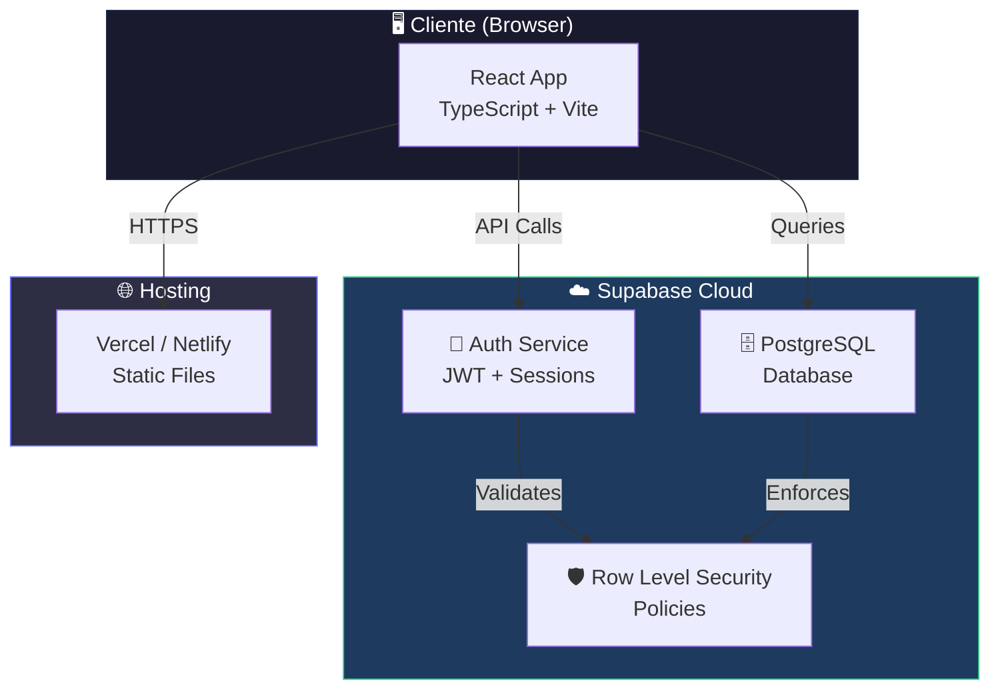
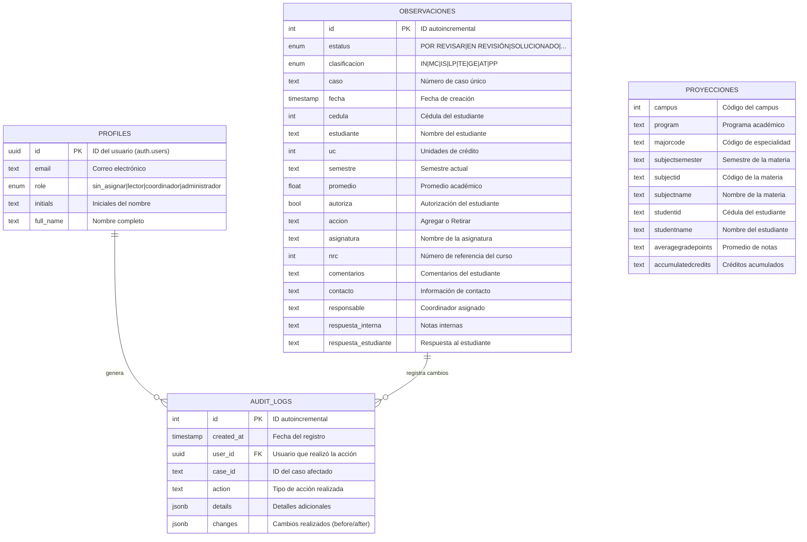
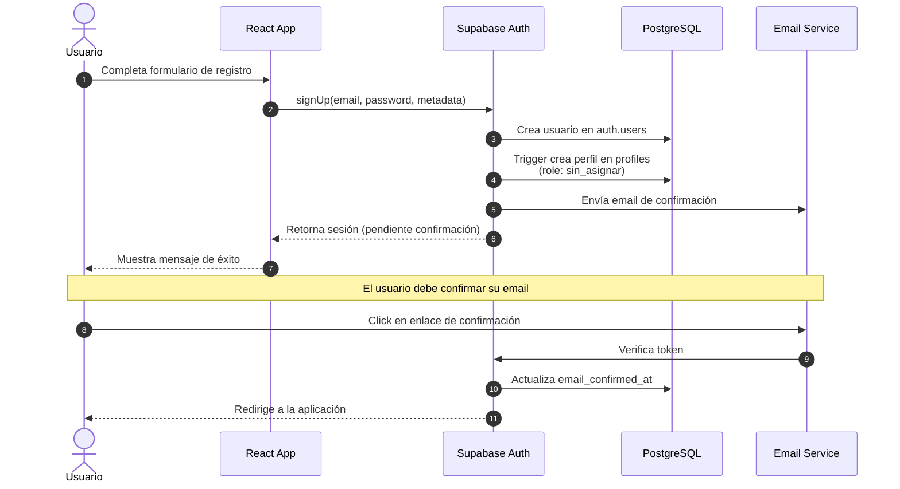
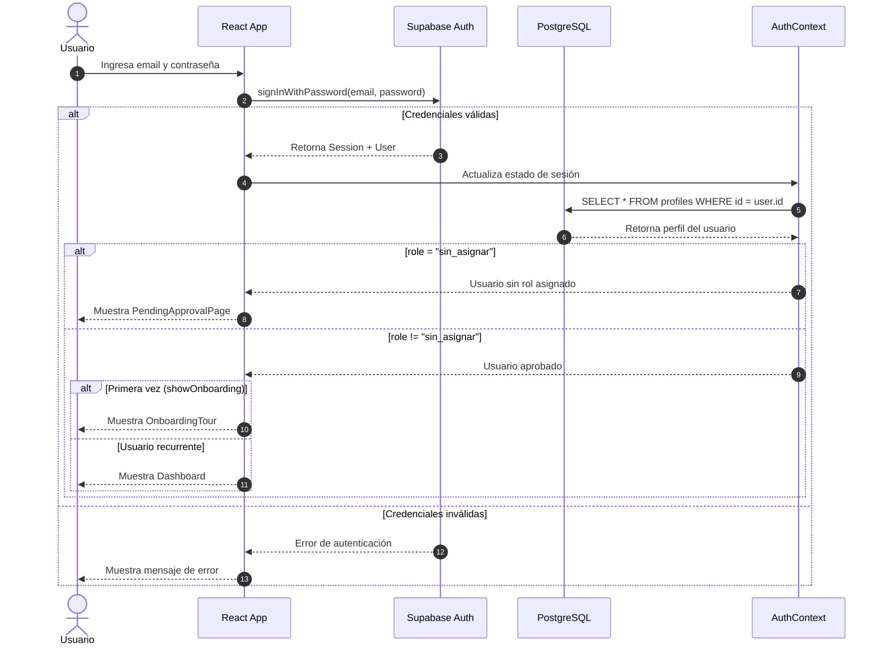
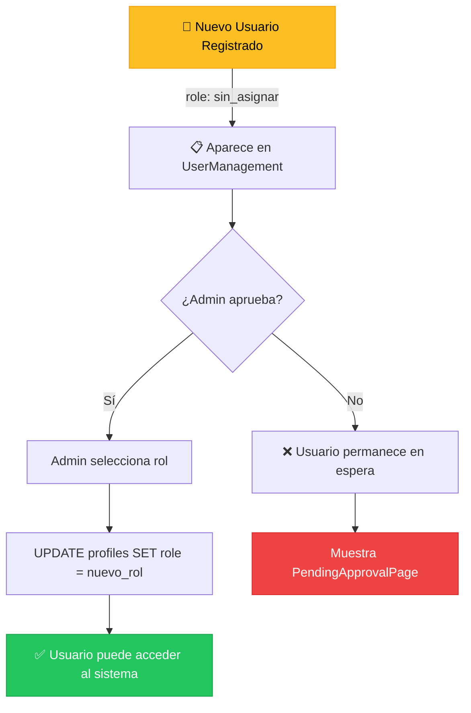
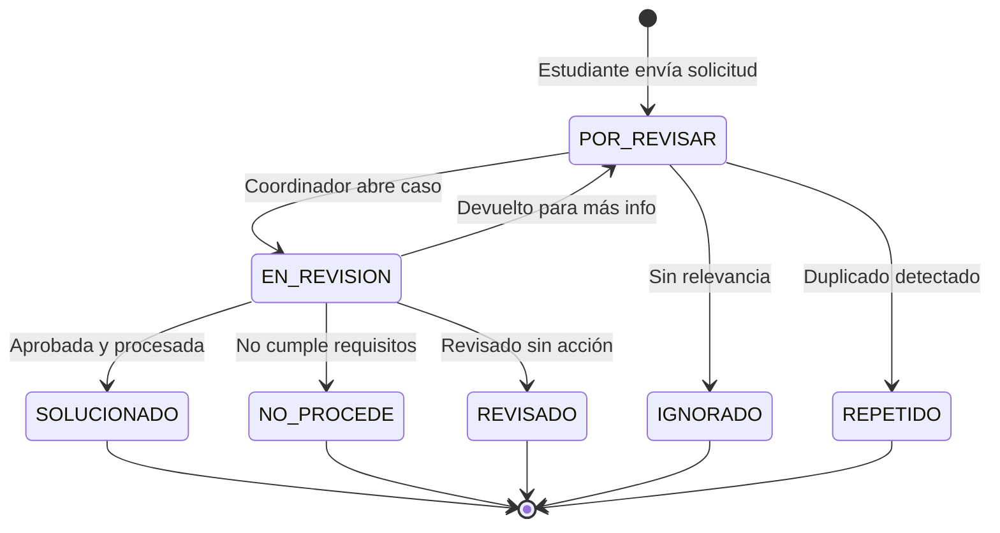
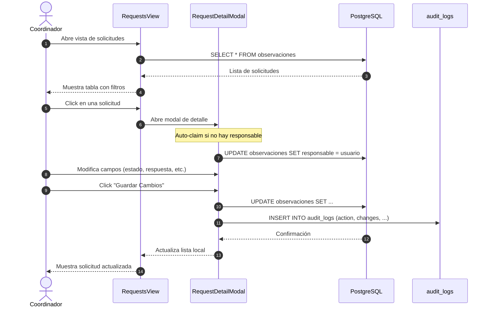
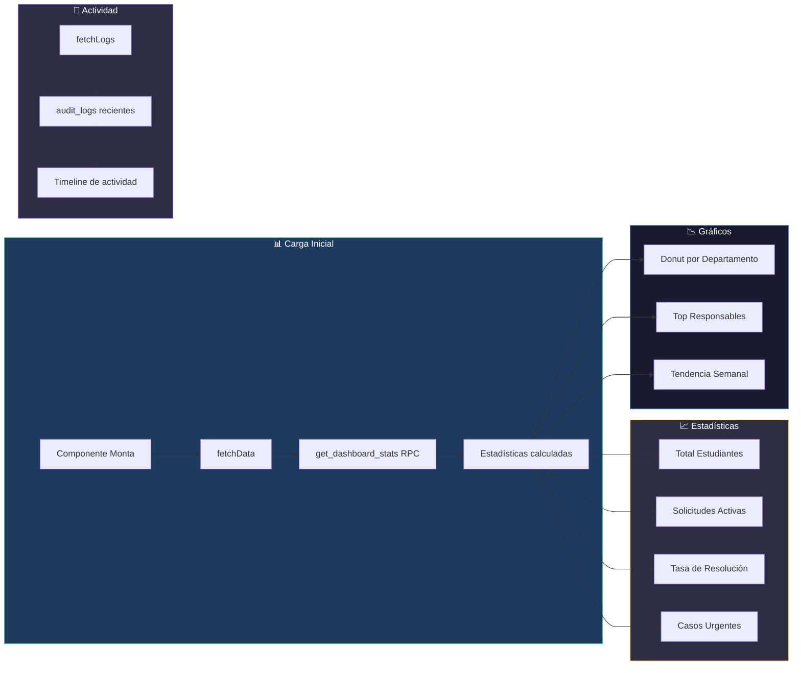
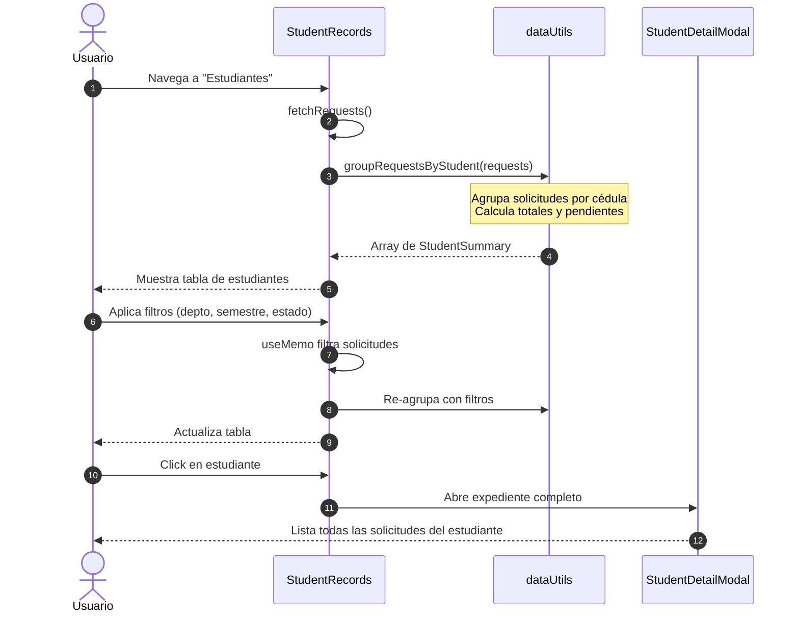
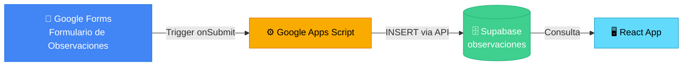

# 🎓 Sistema de Gestión de Observaciones Académicas

Sistema web para la gestión y seguimiento de observaciones de inscripción académica de la Escuela de Ingeniería Informática. Permite a coordinadores y administradores revisar, clasificar y resolver solicitudes estudiantiles de manera eficiente.


---

## ✨ Características Principales

| Funcionalidad | Descripción |
|---------------|-------------|
| 📊 **Dashboard Interactivo** | Estadísticas en tiempo real con gráficos de dona y tendencias |
| 📋 **Gestión de Solicitudes** | CRUD completo con filtros por departamento, estado y fecha |
| 👥 **Vista por Estudiante** | Agrupa todas las solicitudes de un estudiante en un solo expediente |
| 🔐 **Sistema de Roles** | Control de acceso basado en roles (Lector, Coordinador, Administrador) |
| 📝 **Auditoría de Cambios** | Registro completo de todas las modificaciones realizadas |
| 📥 **Exportación Excel** | Descarga de datos filtrados en formato .xlsx |
| 🎯 **Onboarding Interactivo** | Tour guiado para nuevos usuarios |
| 🌙 **Modo Oscuro** | Interfaz adaptable a preferencias del usuario |

---

## 🛠️ Stack Tecnológico

### Frontend
- **React 19.2** - Biblioteca de UI con las últimas características
- **TypeScript 5.9** - Tipado estático para mayor robustez
- **Vite 7.2** - Build tool ultrarrápido con HMR
- **TailwindCSS 3.4** - Framework CSS utility-first
- **Material Symbols** - Iconografía moderna de Google

### Backend (Supabase)
- **Supabase Auth** - Autenticación segura con email/password
- **PostgreSQL 17** - Base de datos relacional robusta
- **Row Level Security (RLS)** - Políticas de seguridad a nivel de fila

### Librerías Adicionales
- **@supabase/supabase-js** - Cliente oficial de Supabase
- **xlsx** - Generación de archivos Excel

---

## 🏗️ Arquitectura del Sistema

### Diagrama de Despliegue



### Estructura del Proyecto

```
academic-ticket-management/
├── public/                  # Archivos estáticos
├── src/
│   ├── assets/             # Recursos (imágenes, etc.)
│   ├── components/         # Componentes React
│   │   ├── DashboardOverview.tsx    # Panel principal con estadísticas
│   │   ├── RequestsView.tsx         # Vista de solicitudes
│   │   ├── StudentRecords.tsx       # Expedientes por estudiante
│   │   ├── UserManagement.tsx       # Gestión de usuarios (admin)
│   │   ├── LoginPage.tsx            # Página de login
│   │   ├── RegisterPage.tsx         # Página de registro
│   │   ├── PendingApprovalPage.tsx  # Página de espera de aprobación
│   │   ├── OnboardingTour.tsx       # Tour de bienvenida
│   │   ├── NavigationSidebar.tsx    # Barra de navegación lateral
│   │   └── ...
│   ├── contexts/
│   │   └── AuthContext.tsx  # Contexto de autenticación global
│   ├── lib/
│   │   └── supabase.ts      # Cliente de Supabase configurado
│   ├── utils/
│   │   └── dataUtils.ts     # Funciones de transformación de datos
│   ├── types.ts             # Definiciones de tipos TypeScript
│   ├── App.tsx              # Componente raíz con routing
│   ├── main.tsx             # Punto de entrada
│   └── index.css            # Estilos globales
├── .env                     # Variables de entorno (no versionado)
├── package.json             # Dependencias y scripts
├── tailwind.config.js       # Configuración de TailwindCSS
├── tsconfig.json            # Configuración de TypeScript
└── vite.config.ts           # Configuración de Vite
```

---

## 📊 Modelo de Datos

### Diagrama Entidad-Relación



### Descripción de Tablas

| Tabla | Propósito | Registros |
|-------|-----------|-----------|
| `profiles` | Almacena información de usuarios y sus roles en el sistema | Variable |
| `observaciones` | Registra todas las solicitudes/tickets de inscripción de estudiantes | ~755 |
| `audit_logs` | Mantiene un historial de todas las acciones realizadas en el sistema | Variable |
| `proyecciones` | Datos de proyección académica para consulta de expedientes | ~7,068 |

### Enumeraciones (ENUMs)

**Estatus de Solicitud:**
- `POR REVISAR` - Nueva solicitud pendiente de revisión
- `EN REVISIÓN` - Siendo evaluada por un coordinador
- `SOLUCIONADO` - Resuelta satisfactoriamente
- `NO PROCEDE` - Rechazada por no cumplir requisitos
- `REPETIDO` - Duplicado de otra solicitud
- `IGNORADO` - Descartada sin acción
- `REVISADO` - Revisada pero sin acción específica

**Clasificación por Departamento:**
- `IN` - Ingeniería Informática
- `MC` - Matemáticas y Computación
- `IS` - Ingeniería de Sistemas
- `LP` - Lenguajes de Programación
- `TE` - Tecnología
- `GE` - General
- `AT` - Atención al Estudiante
- `PP` - Prácticas Profesionales

**Roles de Usuario:**
- `sin_asignar` - Usuario nuevo pendiente de aprobación
- `lector` - Solo puede visualizar información
- `coordinador` - Puede gestionar solicitudes de su área
- `administrador` - Acceso completo al sistema

---

## 🔐 Flujos de Autenticación

### Flujo de Registro de Usuario



### Flujo de Inicio de Sesión



### Flujo de Aprobación de Cuenta (Admin)



### Matriz de Permisos por Rol

| Funcionalidad | sin_asignar | lector | coordinador | administrador |
|---------------|:-----------:|:------:|:-----------:|:-------------:|
| Ver Dashboard | ❌ | ✅ | ✅ | ✅ |
| Ver Solicitudes | ❌ | ✅ | ✅ | ✅ |
| Editar Solicitudes | ❌ | ❌ | ✅ | ✅ |
| Ver Estudiantes | ❌ | ✅ | ✅ | ✅ |
| Gestionar Usuarios | ❌ | ❌ | ❌ | ✅ |
| Exportar Excel | ❌ | ✅ | ✅ | ✅ |

---

## 📈 Flujos de Negocio

### Ciclo de Vida de una Solicitud



**Leyenda de Estados:**
| Estado | Color | Descripción |
|--------|-------|-------------|
| `POR_REVISAR` | 🟡 Amarillo | Nueva solicitud pendiente |
| `EN_REVISION` | 🔵 Azul | Siendo evaluada |
| `SOLUCIONADO` | 🟢 Verde | Resuelta satisfactoriamente |
| `NO_PROCEDE` | 🔴 Rojo | Rechazada |
| `REVISADO` | 🩶 Gris | Revisada sin acción específica |
| `REPETIDO` | ⚪ Gris claro | Duplicado |
| `IGNORADO` | ⚪ Gris claro | Descartada |


### Flujo de Gestión de Solicitudes



### Flujo del Dashboard



### Flujo de Vista por Estudiante



---

## 🚀 Instalación y Configuración

### Prerrequisitos

- **Node.js** >= 18.x
- **npm** >= 9.x o **pnpm** >= 8.x
- Cuenta en [Supabase](https://supabase.com) (plan gratuito disponible)

### Variables de Entorno

Crear un archivo `.env` en la raíz del proyecto con las siguientes variables:

```env
# Supabase Configuration
VITE_SUPABASE_URL=https://tu-proyecto.supabase.co
VITE_SUPABASE_ANON_KEY=tu-anon-key-publica
```

> [!NOTE]
> Las credenciales de Supabase se obtienen desde el dashboard del proyecto en:
> **Settings → API → Project URL** y **Project API keys (anon/public)**

### Pasos de Instalación

```bash
# 1. Clonar el repositorio
git clone https://github.com/tu-usuario/academic-ticket-management.git
cd academic-ticket-management

# 2. Instalar dependencias
npm install

# 3. Configurar variables de entorno
cp .env.example .env
# Editar .env con tus credenciales de Supabase

# 4. Iniciar servidor de desarrollo
npm run dev
```

La aplicación estará disponible en `http://localhost:5173`

---

## 📦 Scripts Disponibles

| Script | Comando | Descripción |
|--------|---------|-------------|
| **dev** | `npm run dev` | Inicia servidor de desarrollo con HMR |
| **build** | `npm run build` | Compila TypeScript y genera bundle de producción |
| **preview** | `npm run preview` | Sirve el build de producción localmente |
| **lint** | `npm run lint` | Ejecuta ESLint para análisis de código |

### Ejemplo de Uso

```bash
# Desarrollo local
npm run dev

# Build para producción
npm run build

# Previsualizar build
npm run preview
```

---

## 🌐 Despliegue

### Despliegue en Vercel (Recomendado)

1. Conectar repositorio en [vercel.com](https://vercel.com)
2. Configurar variables de entorno en el dashboard de Vercel
3. El despliegue será automático con cada push a `main`

```bash
# Configuración en vercel.json (opcional)
{
  "framework": "vite",
  "buildCommand": "npm run build",
  "outputDirectory": "dist"
}
```

### Despliegue en Netlify

1. Conectar repositorio en [netlify.com](https://netlify.com)
2. Configurar:
   - **Build command:** `npm run build`
   - **Publish directory:** `dist`
3. Agregar variables de entorno en Site settings

### Build Manual

```bash
# Generar build optimizado
npm run build

# Los archivos estáticos estarán en ./dist
# Subir contenido de dist/ a cualquier hosting estático
```

---

## 🔧 Configuración de Supabase

### Tablas Requeridas

El sistema requiere las siguientes tablas en Supabase:

1. **profiles** - Se crea automáticamente con un trigger en `auth.users`
2. **observaciones** - Datos de solicitudes (se pobla automáticamente)
3. **audit_logs** - Se crea para rastrear cambios
4. **proyecciones** - Datos de proyección académica (actualización semestral)

### 📥 Fuentes de Datos

#### Observaciones (Automático)

La tabla `observaciones` se **pobla automáticamente** desde un formulario de Google Forms mediante un script de **Google Apps Script**. 



> [!IMPORTANT]
> El script de Apps Script debe estar configurado con las credenciales de Supabase y un trigger `onFormSubmit` para sincronizar automáticamente las nuevas observaciones.

#### Proyecciones (Semestral)

La tabla `proyecciones` contiene datos de proyección académica de los estudiantes y debe **actualizarse cada inicio de semestre**:

1. Exportar datos de proyección desde el sistema académico institucional
2. Limpiar la tabla existente (opcional, según política de retención)
3. Importar el nuevo archivo CSV/Excel a Supabase

```bash
# Ejemplo: Importar proyecciones usando Supabase CLI
supabase db import --table proyecciones --file proyecciones_202601.csv
```

> [!NOTE]
> Los datos de proyecciones son utilizados para enriquecer los expedientes de estudiantes y no son modificados por la aplicación.


### Trigger para Crear Perfiles

```sql
-- Crear función para nuevo usuario
CREATE OR REPLACE FUNCTION public.handle_new_user()
RETURNS TRIGGER AS $$
BEGIN
  INSERT INTO public.profiles (id, email, role, initials, full_name)
  VALUES (
    NEW.id,
    NEW.email,
    'sin_asignar',
    UPPER(SUBSTRING(NEW.email FROM 1 FOR 2)),
    COALESCE(NEW.raw_user_meta_data->>'full_name', 'Usuario')
  );
  RETURN NEW;
END;
$$ LANGUAGE plpgsql SECURITY DEFINER;

-- Crear trigger
CREATE TRIGGER on_auth_user_created
  AFTER INSERT ON auth.users
  FOR EACH ROW EXECUTE FUNCTION public.handle_new_user();
```

### Función RPC para Dashboard

```sql
-- Función para obtener estadísticas del dashboard
CREATE OR REPLACE FUNCTION get_dashboard_stats()
RETURNS JSON AS $$
  -- Ver implementación en migraciones del proyecto
$$ LANGUAGE plpgsql;
```

---

## 🤝 Contribución

1. Fork el repositorio
2. Crear rama para feature: `git checkout -b feature/nueva-funcionalidad`
3. Commit cambios: `git commit -am 'Añade nueva funcionalidad'`
4. Push a la rama: `git push origin feature/nueva-funcionalidad`
5. Crear Pull Request

---

## 📄 Licencia

Este proyecto es de uso interno para la Escuela de Ingeniería Informática.

---

<div align="center">

**Desarrollado con ❤️ para la Escuela de Ingeniería Informática**

[](https://react.dev)
[](https://typescriptlang.org)
[](https://supabase.com)

</div>
