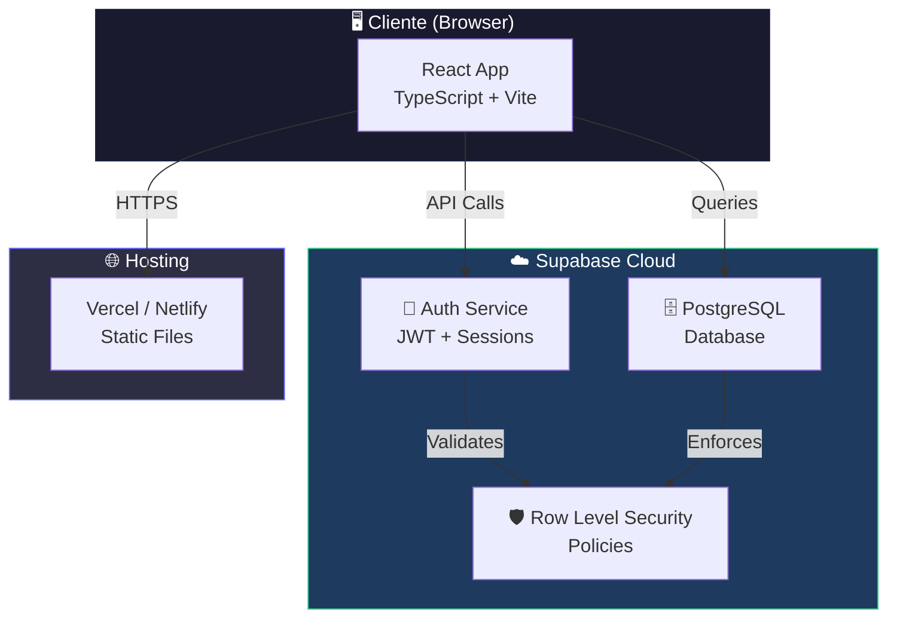
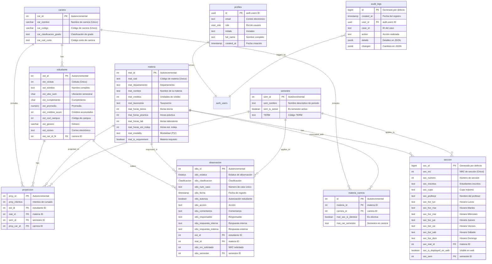
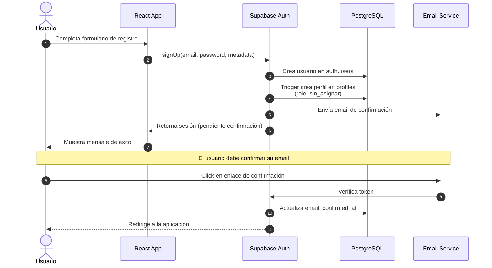
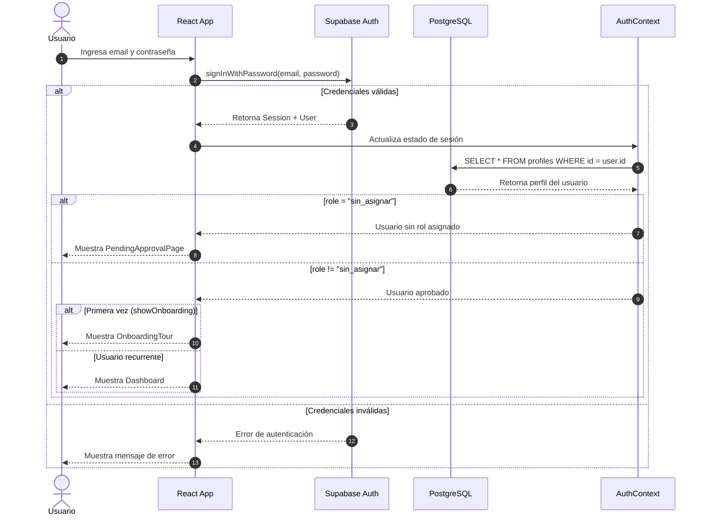
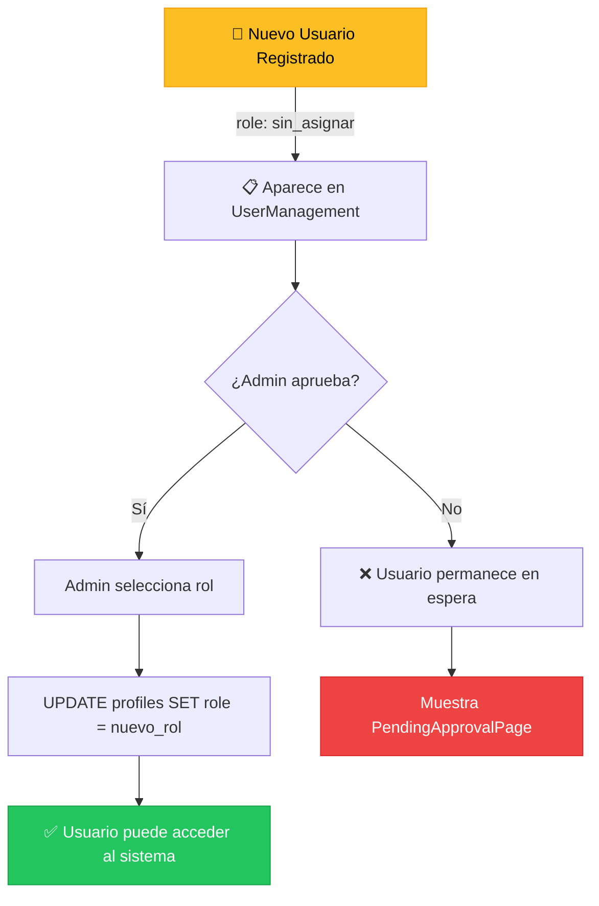
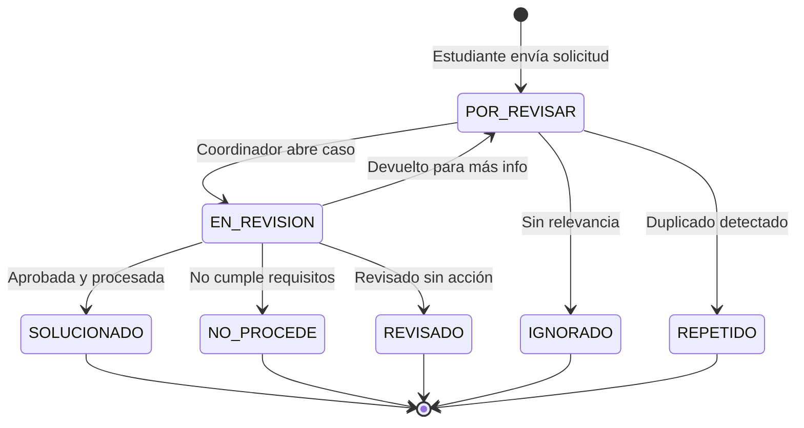
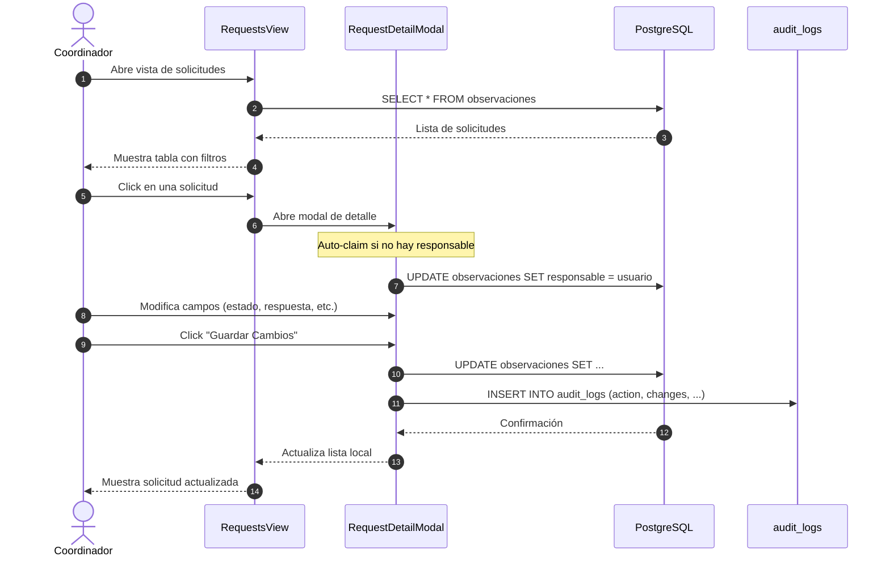
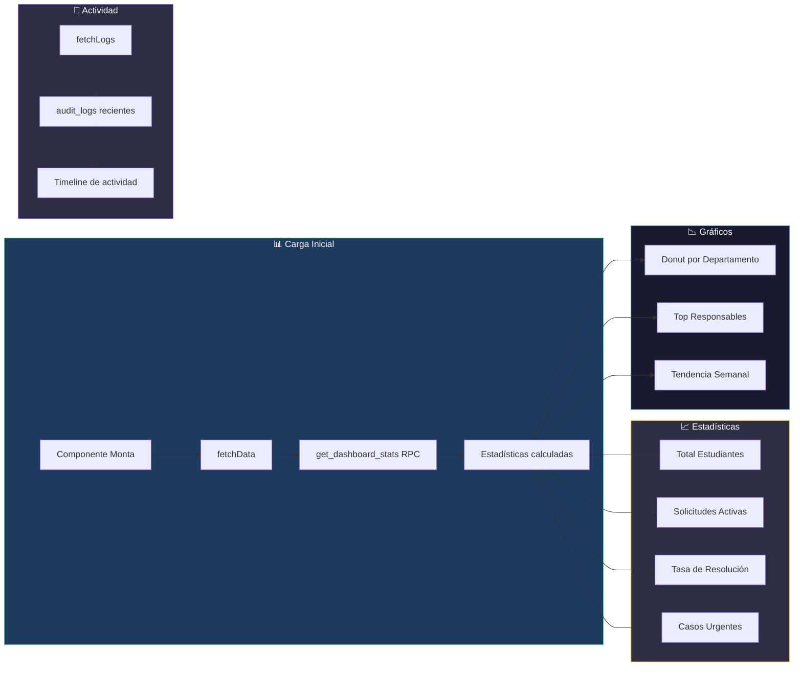
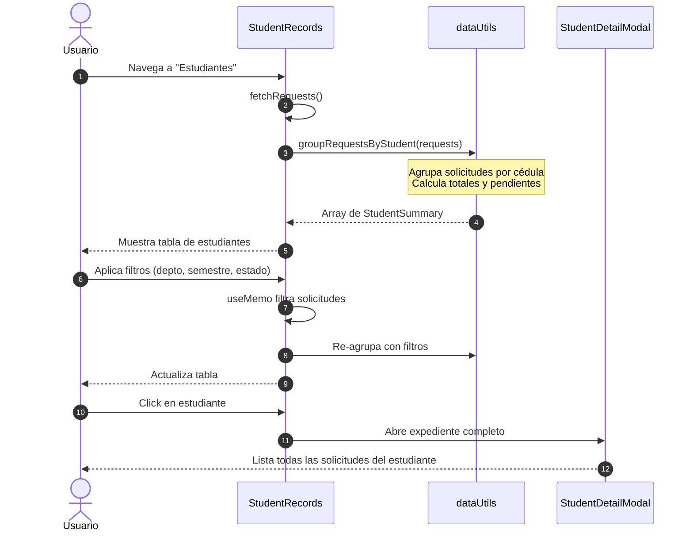
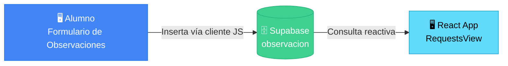

# 🎓 Sistema de Gestión de Observaciones Académicas

Sistema web para la gestión y seguimiento de observaciones de inscripción académica de la Escuela de Ingeniería Informática. Permite a coordinadores y administradores revisar, clasificar y resolver solicitudes estudiantiles de manera eficiente.


---

## ✨ Características Principales

| Funcionalidad | Descripción |
|---------------|-------------|
| 📊 **Dashboard Interactivo** | Estadísticas en tiempo real con gráficos de dona, métricas clave y registro de actividad |
| 📋 **Gestión de Solicitudes** | CRUD completo con filtros por departamento, estado, responsable, buscador y asignación automática |
| 👥 **Vista por Estudiante** | Agrupa todas las solicitudes de un estudiante en un solo expediente para ver su historial académico completo |
| 📅 **Constructor de Horarios** | Herramienta gráfica interactiva para que estudiantes armen su horario ideal, resuelvan colisiones visuales de secciones y guarden sus selecciones de manera persistente |
| 📤 **Carga y Gestión Masiva** | Panel administrativo para importar y gestionar semestres, materias, proyecciones y horarios desde archivos Excel/CSV |
| 🛠️ **Utilidades Académicas** | Herramientas de balanceo de secciones (algoritmo multi-nivel de reubicación), cierre de secciones (simulador de reubicación automática de alumnos) y auditoría de proyecciones |
| 🔐 **Sistema de Roles** | Control de acceso basado en roles (Lector, Coordinador, Administrador) con restricciones a nivel de frontend y políticas RLS en base de datos |
| 📝 **Auditoría de Cambios** | Registro automático de auditoría en la base de datos para todas las modificaciones críticas de solicitudes o roles |
| 📥 **Exportación Excel** | Descarga de reportes filtrados y propuestas de balanceo/cierre de secciones en formato Excel (.xlsx) |
| 🎯 **Onboarding Interactivo** | Tour guiado paso a paso para facilitar la adopción por parte de coordinadores nuevos |
| 🌙 **Modo Oscuro** | Interfaz adaptable y pulida compatible con preferencias del sistema y usuario |

---

## 🛠️ Stack Tecnológico

### Frontend
- **React 19.2** - Biblioteca de UI con las últimas características
- **TypeScript 5.9** - Tipado estático para mayor robustez
- **Vite 7.2** - Build tool ultrarrápido con HMR
- **TailwindCSS 3.4** - Framework CSS utility-first
- **Material Symbols** - Iconografía moderna de Google

### Backend (Supabase)
- **Supabase Auth** - Autenticación segura con email/password
- **PostgreSQL 17** - Base de datos relacional robusta
- **Row Level Security (RLS)** - Políticas de seguridad a nivel de fila

### Librerías Adicionales
- **@supabase/supabase-js** - Cliente oficial de Supabase
- **xlsx** - Generación de archivos Excel

---

## 🏗️ Arquitectura del Sistema

### Diagrama de Despliegue



### Estructura del Proyecto

```
academic-ticket-management/
├── public/                  # Archivos estáticos
├── shortcodes/              # Herramientas y páginas estáticas HTML/JS standalone (integrables externamente)
│   ├── enrollment-recommendations.html # Constructor interactivo de horarios y visualizador de materias por semestre
│   ├── formulario_observaciones.html   # Formulario inteligente para radicar observaciones/solicitudes de estudiantes
│   ├── enrollment-responses.html       # Visualizador estático de respuestas a solicitudes
│   ├── subject-schedule.html           # Buscador simple de horarios y materias
│   └── test-builder.html               # Sandbox/entorno experimental del constructor de horarios
├── src/
│   ├── assets/             # Recursos (imágenes, etc.)
│   ├── components/         # Componentes React (SPA)
│   │   ├── DashboardOverview.tsx    # Panel principal con estadísticas
│   │   ├── RequestsView.tsx         # Vista de solicitudes (CRUD + Auditoría)
│   │   ├── StudentRecords.tsx       # Expedientes por estudiante
│   │   ├── UserManagement.tsx       # Gestión de usuarios (admin)
│   │   ├── UploadProjections.tsx    # Panel de administración e importación de datos
│   │   ├── SectionBalancing.tsx     # Utilidad de Balanceo de Secciones
│   │   ├── SectionClosing.tsx       # Utilidad de Cierre de Secciones
│   │   ├── ProjectionAudit.tsx      # Utilidad de Auditoría de Proyecciones
│   │   ├── MateriaModal.tsx         # Modal de gestión individual de materias
│   │   ├── LoginPage.tsx            # Página de login
│   │   ├── RegisterPage.tsx         # Página de registro
│   │   ├── PendingApprovalPage.tsx  # Página de espera de aprobación
│   │   ├── OnboardingTour.tsx       # Tour de bienvenida
│   │   ├── NavigationSidebar.tsx    # Barra de navegación lateral
│   │   └── ...
│   ├── contexts/
│   │   └── AuthContext.tsx  # Contexto de autenticación global
│   ├── lib/
│   │   └── supabase.ts      # Cliente de Supabase configurado
│   ├── utils/
│   │   └── dataUtils.ts     # Funciones de transformación de datos
│   ├── types.ts             # Definiciones de tipos TypeScript
│   ├── App.tsx              # Componente raíz con routing reactivo (basado en estados)
│   ├── main.tsx             # Punto de entrada
│   └── index.css            # Estilos globales y tokens
├── .env                     # Variables de entorno (no versionado)
├── package.json             # Dependencias y scripts
├── tailwind.config.js       # Configuración de TailwindCSS
├── tsconfig.json            # Configuración de TypeScript
└── vite.config.ts           # Configuración de Vite
```

---

## 📊 Modelo de Datos

### Diagrama Entidad-Relación



### Descripción de Tablas

| Tabla | Propósito |
|-------|-----------|
| `profiles` | Almacena información de usuarios y sus roles en el sistema (Lector, Coordinador, Administrador) |
| `carrera` | Catálogo maestro de carreras universitarias y programas (tanto Majors como Minors) |
| `estudiante` | Listado maestro de estudiantes con su información académica, promedio, créditos acumulados y carrera asociada |
| `materia` | Listado maestro de asignaturas con sus créditos, taxonomía, distribución de horas, modalidad y prerrequisitos |
| `materia_carrera` | Relación intermedia que define a qué carreras pertenece cada materia, el semestre sugerido y si es electiva |
| `seccion` | Registro detallado de cada sección/NRC de materias, incluyendo cupos, inscritos, profesor y sus horarios semanales por bloque |
| `semestre` | Control de periodos académicos (semestres ordinarios e intensivos) y su estado activo actual |
| `proyeccion` | Tabla intermedia de intersección que define la proyección de una materia para un estudiante en un semestre y carrera específicos |
| `observacion` | Registra todas las solicitudes y observaciones hechas por los estudiantes relativas a una materia, sección, estudiante y semestre |
| `audit_logs` | Mantiene una bitácora detallada de todas las acciones de edición y cambios de roles para auditoría |

### Enumeraciones (ENUMs)

**Estatus de Solicitud:**
- `POR REVISAR` - Nueva solicitud pendiente de revisión
- `EN REVISIÓN` - Siendo evaluada por un coordinador
- `SOLUCIONADO` - Resuelta satisfactoriamente
- `NO PROCEDE` - Rechazada por no cumplir requisitos
- `REPETIDO` - Duplicado de otra solicitud
- `IGNORADO` - Descartada sin acción
- `REVISADO` - Revisada pero sin acción específica

**Clasificación por Departamento:**
- `IN` - Ingeniería Informática
- `MC` - Matemáticas y Computación
- `IS` - Ingeniería de Sistemas
- `LP` - Lenguajes de Programación
- `TE` - Tecnología
- `GE` - General
- `AT` - Atención al Estudiante
- `PP` - Prácticas Profesionales

**Roles de Usuario:**
- `sin_asignar` - Usuario nuevo pendiente de aprobación
- `lector` - Solo puede visualizar información
- `coordinador` - Puede gestionar solicitudes de su área
- `administrador` - Acceso completo al sistema

---

## 🔐 Flujos de Autenticación

### Flujo de Registro de Usuario



### Flujo de Inicio de Sesión



### Flujo de Aprobación de Cuenta (Admin)



### Matriz de Permisos por Rol

| Funcionalidad | sin_asignar | lector | coordinador | administrador |
|---------------|:-----------:|:------:|:-----------:|:-------------:|
| Ver Dashboard | ❌ | ✅ | ✅ | ✅ |
| Ver Solicitudes | ❌ | ✅ | ✅ | ✅ |
| Editar Solicitudes | ❌ | ❌ | ✅ | ✅ |
| Ver Estudiantes | ❌ | ✅ | ✅ | ✅ |
| Gestionar Usuarios | ❌ | ❌ | ❌ | ✅ |
| Exportar Excel | ❌ | ✅ | ✅ | ✅ |

---

## 📈 Flujos de Negocio

### Ciclo de Vida de una Solicitud



**Leyenda de Estados:**
| Estado | Color | Descripción |
|--------|-------|-------------|
| `POR_REVISAR` | 🟡 Amarillo | Nueva solicitud pendiente |
| `EN_REVISION` | 🔵 Azul | Siendo evaluada |
| `SOLUCIONADO` | 🟢 Verde | Resuelta satisfactoriamente |
| `NO_PROCEDE` | 🔴 Rojo | Rechazada |
| `REVISADO` | 🩶 Gris | Revisada sin acción específica |
| `REPETIDO` | ⚪ Gris claro | Duplicado |
| `IGNORADO` | ⚪ Gris claro | Descartada |


### Flujo de Gestión de Solicitudes



### Flujo del Dashboard



### Flujo de Vista por Estudiante



---

## 🚀 Instalación y Configuración

### Prerrequisitos

- **Node.js** >= 18.x
- **npm** >= 9.x o **pnpm** >= 8.x
- Cuenta en [Supabase](https://supabase.com) (plan gratuito disponible)

### Variables de Entorno

Crear un archivo `.env` en la raíz del proyecto con las siguientes variables:

```env
# Supabase Configuration
VITE_SUPABASE_URL=https://tu-proyecto.supabase.co
VITE_SUPABASE_ANON_KEY=tu-anon-key-publica
```

> [!NOTE]
> Las credenciales de Supabase se obtienen desde el dashboard del proyecto en:
> **Settings → API → Project URL** y **Project API keys (anon/public)**

### Pasos de Instalación

```bash
# 1. Clonar el repositorio
git clone https://github.com/tu-usuario/academic-ticket-management.git
cd academic-ticket-management

# 2. Instalar dependencias
npm install

# 3. Configurar variables de entorno
cp .env.example .env
# Editar .env con tus credenciales de Supabase

# 4. Iniciar servidor de desarrollo
npm run dev
```

La aplicación estará disponible en `http://localhost:5173`

---

## 📦 Scripts Disponibles

| Script | Comando | Descripción |
|--------|---------|-------------|
| **dev** | `npm run dev` | Inicia servidor de desarrollo con HMR |
| **build** | `npm run build` | Compila TypeScript y genera bundle de producción |
| **preview** | `npm run preview` | Sirve el build de producción localmente |
| **lint** | `npm run lint` | Ejecuta ESLint para análisis de código |

### Ejemplo de Uso

```bash
# Desarrollo local
npm run dev

# Build para producción
npm run build

# Previsualizar build
npm run preview
```

---

## 🌐 Despliegue

### Despliegue en Vercel (Recomendado)

1. Conectar repositorio en [vercel.com](https://vercel.com)
2. Configurar variables de entorno en el dashboard de Vercel
3. El despliegue será automático con cada push a `main`

```bash
# Configuración en vercel.json (opcional)
{
  "framework": "vite",
  "buildCommand": "npm run build",
  "outputDirectory": "dist"
}
```

### Despliegue en Netlify

1. Conectar repositorio en [netlify.com](https://netlify.com)
2. Configurar:
   - **Build command:** `npm run build`
   - **Publish directory:** `dist`
3. Agregar variables de entorno en Site settings

### Build Manual

```bash
# Generar build optimizado
npm run build

# Los archivos estáticos estarán en ./dist
# Subir contenido de dist/ a cualquier hosting estático
```

---

## 🔧 Configuración de Supabase

### Tablas Requeridas

El sistema requiere las siguientes tablas en Supabase:

1. **profiles** - Tabla de perfiles de usuario, creada automáticamente con un trigger en `auth.users`.
2. **observacion** - Registros de solicitudes y observaciones de estudiantes.
3. **audit_logs** - Bitácora de cambios para auditoría de acciones del personal.
4. **proyeccion** - Datos de proyección académica por estudiante.
5. **carrera** - Catálogo maestro de carreras y programas académicos (Majors y Minors).
6. **materia** - Catálogo maestro de asignaturas con sus créditos, taxonomías y horas.
7. **materia_carrera** - Relación de asignaturas pertenecientes a cada carrera (incluyendo electivas).
8. **semestre** - Registro de periodos académicos (semestres e intensivos) con indicación de cuál es el periodo activo.

### 📥 Entrada de Observaciones (Estudiantes)

Las observaciones y solicitudes de ajuste de NRC son radicadas directamente por los estudiantes usando el formulario web independiente en el shortcode: [formulario_observaciones.html](file:///c:/Users/luisr/dev/academic-ticket-management/shortcodes/formulario_observaciones.html).



> [!NOTE]
> Este formulario realiza la carga dinámica de los datos del estudiante y sus materias proyectadas directamente desde la base de datos al validar su cédula, permitiéndole elegir de forma interactiva la acción a solicitar. En caso de no existir datos o proyección cargada, le permite auto-registrarse de manera sencilla.

#### Datos Académicos y Carga Masiva (Panel de Datos - Admin)

El sistema permite a los administradores cargar y sincronizar los datos maestros directamente desde la interfaz web en la sección **Datos** sin requerir CLI o acceso directo al motor de base de datos:

1. **Carga de Proyecciones (Semestral)**:
   - Se realiza al inicio de cada periodo académico.
   - Se selecciona la carrera y periodo académico correspondientes.
   - El archivo Excel/CSV debe contener las columnas `studentId`, `averageGradePoints`, `accumulatedCredits`, `subjectId` y `attempts`.
   - La base de datos ejecuta el stored procedure `upload_proyecciones`, el cual limpia de manera atómica las proyecciones previas del periodo y carrera seleccionados antes de insertar los nuevos registros.

2. **Carga de Horarios**:
   - Importa el archivo de planificación de secciones y horarios de la carrera en el periodo.
   - El archivo CSV debe usar delimitador de punto y coma `;` y tener las columnas de horarios estándar (LUNES, MARTES, MIERCOLES, JUEVES, VIERNES, SABADO, DOMINGO, SSBSECT_CRN, SSBSECT_SUBJ_CODE, SSBSECT_CRSE_NUMB, PROFESOR, SECCION, INSCRITOS, CUPO).
   - Utiliza el stored procedure `upload_horarios_programa`, limpiando previamente los horarios de la carrera y periodo seleccionados.

3. **Carga de Estudiantes General**:
   - Sincroniza el listado maestro de estudiantes del sistema académico institucional.
   - Procesa archivos CSV grandes por lotes de 500 registros usando el stored procedure `upload_estudiantes_general`.

4. **Creación y Activación de Semestres (Periodos / TERM)**:
   - Permite a los administradores registrar nuevos periodos (ej. `202625` para Sem Mar/Jul 2025-26) y seleccionar cuál periodo se define como el periodo activo del sistema para las solicitudes y simulaciones.

5. **Catálogo de Materias**:
   - Listado maestro y completo de asignaturas en el que se pueden buscar, crear o editar detalles como créditos, taxonomía, distribución de horas (teoría, práctica, laboratorio, independiente), modalidad y dependencias.


### Trigger para Crear Perfiles

```sql
-- Crear función para nuevo usuario
CREATE OR REPLACE FUNCTION public.handle_new_user()
RETURNS TRIGGER AS $$
BEGIN
  INSERT INTO public.profiles (id, email, role, initials, full_name)
  VALUES (
    NEW.id,
    NEW.email,
    'sin_asignar',
    UPPER(SUBSTRING(NEW.email FROM 1 FOR 2)),
    COALESCE(NEW.raw_user_meta_data->>'full_name', 'Usuario')
  );
  RETURN NEW;
END;
$$ LANGUAGE plpgsql SECURITY DEFINER;

-- Crear trigger
CREATE TRIGGER on_auth_user_created
  AFTER INSERT ON auth.users
  FOR EACH ROW EXECUTE FUNCTION public.handle_new_user();
```

### Función RPC para Dashboard

```sql
-- Función para obtener estadísticas del dashboard
CREATE OR REPLACE FUNCTION get_dashboard_stats()
RETURNS JSON AS $$
  -- Ver implementación en migraciones del proyecto
$$ LANGUAGE plpgsql;
```

---

## 🤝 Contribución

1. Fork el repositorio
2. Crear rama para feature: `git checkout -b feature/nueva-funcionalidad`
3. Commit cambios: `git commit -am 'Añade nueva funcionalidad'`
4. Push a la rama: `git push origin feature/nueva-funcionalidad`
5. Crear Pull Request

---

## 📄 Licencia

Este proyecto es de uso interno para la Escuela de Ingeniería Informática.

---

<div align="center">

**Desarrollado con ❤️ para la Escuela de Ingeniería Informática**

[](https://react.dev)
[](https://typescriptlang.org)
[](https://supabase.com)

</div>
